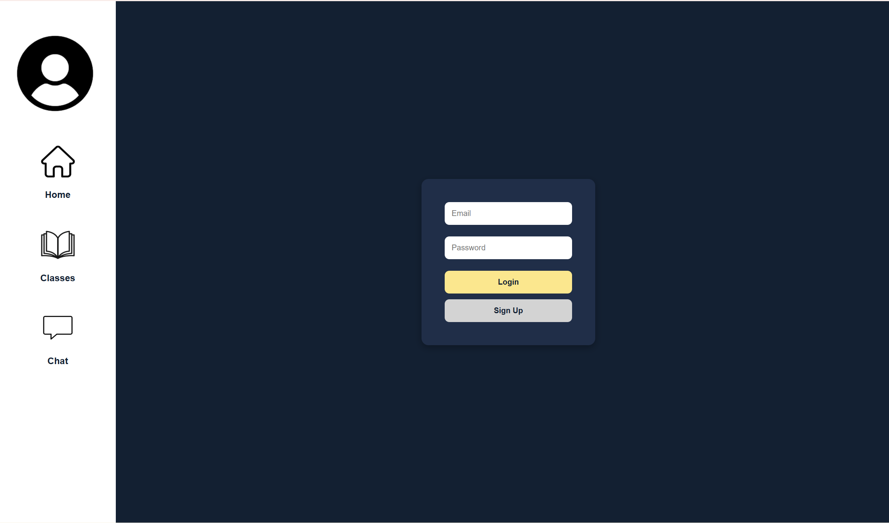
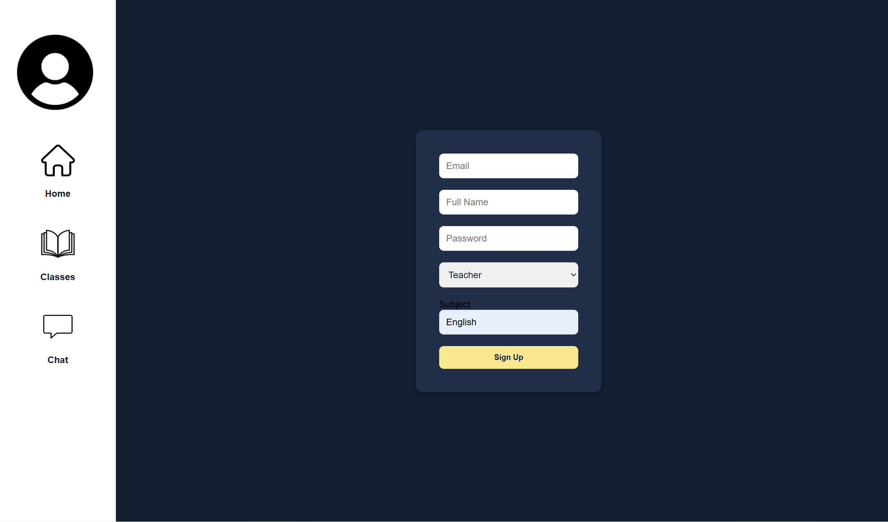

# Week 1

## Project Definition
The goal of this project is to create a web application for a client, set up on github. The web application must have a working frontend and backend that can communicate with each other, created using a variety of different progamming methods including httml/css, Sqllite, and others. This web application is to be created in a set of weekly sprints, incorporating feedback from the client into the final product so it is tailored specifically to their needs. The web application should be designed around social network designed in the project at the end of last year.

## Requirements
### Functional:
- Timetable displaying periods throughout the day
- Messaging system for users to connect
- User authentication
- Assignment submission

### Non-Functional
- Multiple web pages
- Suitable colouring of backgrounds and text
- Appropiately sized and fonted text
- Inclusion of images and other elements

# Week 2

| Design Choice | Description |
| ----------- | ----------- |
| Colour Palette | I decided on a simple two colour design of white text on a navy blue background. It's basic but aesthetically pleasing, and the text is easily legible.  |
| Typography | I decided on the font 'Inter', as it is simple and easily legible. It is also one of the most professionally used fonts, so it works well with my website's design. |
| Image/Icon choice | I used a simple logo that will appear on the loading screen whenever the app is opened. I also used profile pictures for the messaging system, so that users can be distinguished. These profile pictures will be customisable for each user once the app is completed. |

# Week 3

| Design Choice | Description |
| ----------- | ----------- |
| Colour Palette | I kept majority of the colour palette the same in my alternate design, using the same navy blue and white. However, I changed some of the colouring on specific parts of my UI, such as making the navigation menu white rather than the previous dark blue.  |
| Typography | I decided to keep the font 'Inter', as it looks nice and is easily readable. |
| Image/Icon choice | My images and icons, such as the logo and profile pictures, remain the same in my alternate design. However, I did change the layout of some of the images, such as keeping the brand logo in the corner of every page now instead of just the loading screen. |
| Layout | Additionally, I changed the layout of my UI a lot as part of the alternate design. My design was mainly centered around changing the interface from a phone to a computer, meaning there is a lot more space on the screen to work with. This allowed me to leave more empty space on each of my pages to to create a more clean and aesthetically pleasing visual. Additionally, I moved a lot of the UI around, such as the navigation menu moving from the bottom to the side, as well as a complete redesign of the Home page and Timetable page. |

# Week 4

## Algorithm Design
The algorithm:

Test cases:
| Test Case name | Preconditions | Test steps | Expected result |
| ----------- | ----------- | ----------- | ----------- |
| User attempts to send message | User must have the application, and have the messaging system open | Type in a message, hit the send button | User will be able to send the message effectively |
| User attempts to send inappropriate message | User must have the application, and have the messaging system open | Type in an inappropriate message, hit the send button | User will receive error message 'Message failed to send: Inappropriate content detected', and message will fail to send |

# Week 5

## Setting up the Database

**Monday, 18/08/25**
Today, I began setting up the database by following through the instructions in the setup document on google classroom. I downloaded python, pip, and all of the required extensions, before working through the document up until the creation of the files and the folders.

**Tuesday, 19/08/25**
Today, I finished working through the document and setting up my database, including creating all of the folders necessary for my database.

**Thursday, 21/08/25**
Today, I figured out how to create the necessary tables for my database and presented my (somewhat) complete database to my client.

# Week 6

**Monday, 25/08/25**
Today I finished creating all my necessary tables including a users table, a messages table, a contacts table, a timetable table, and a classes table. I also populated my database with data, including 10 unique users and 13 different classes/subjects.

**Tuesday, 26/08/25**
Today I started designing my SQL queries, including one to show all users and classes, which will be helpful in locating specific data from my table that needs to be sorted through when I later add functionality. Additionally, I created a query to figure out which classes a user is taken, which will be necessary later on when creating a functional timetable.

**Wednesday, 27/08/25**
Today I finished off my last two SQL queries and presented my database to my client. These SQL queries included one to view the timetable for a specific class, which I will also need later on when creating the timetable, as well as a query to see messages sent by a specific user, which will need to be found when designing my messaging system.

# Week 7

**Monday, 01/09/25**
Today I worked through the example document to set up a basic html/css page. However, i deleted most of the code as I didn't need the contact cards, and began writing my own to better format my headers.

**Tuesday, 02/09/25**
Today I worked a lot on my homepage, placing my headers in the desired places on the page the same way I had designed them in my figma, before creating places to see both public and private messages as well as a timetable icon in the top left. Additionally, I coloured my page using CSS and gave it some small design touches such as the rounding of corners.

**Thursday, 04/09/25**
Today I finalised formatting the layout and design of my homepage, before presenting my homepage to my client (although it was slightly behind schedule).

# Week 8

**Monday, 08/09/25**
Today I created two additional pages for my timetable and chat pages, before beginning to deign my timetable page. It was fairly simple, as I followed my figma design and created 8 blank grey boxes (which will later change colour/text once I implement functionality), as well as a bar at the top that will eventually show the current/upcoming class.

**Tuesday, 09/09/25**
Today, I quickly finished my timetable page by adding a logo in the corner, before beginning on the design of my chat page. I divided the page into two columns the same way I designed in my figma, before creating a series of little grey boxes for contact cards and a (very basic) set of bubbles and a messaging bar for the actual messages.

**Wednesday, 10/09/25**
Today I finalised the design/colouring of my chat page, before presenting all three of my pages to my client.

# Week 9

**Monday, 15/09/25**
Today I worked on implementing the example code into my app, including set up all of my javascript files. I also fiddled with my main.py and database_manager.py files for a bit to figure out how to link them to my database.

**Tuesday, 16/09/25**
Today I began (trying) to add functionality to my messaging system, although it was a bit of a struggle trying to figure out how to use javascript. In the end I managed to make the contact buttons interactable so they would highlight when you clicked on them individually. Additionally I ran a lighthouse report on each of my pages and took screenshots of the results, which were all near perfect except for best practices.

**Thursday, 18/09/25**
Today I presented my app to my client, as well as the lighthouse reports that I had run previously. Additionally, I continued (trying) to implement some functionality into my messaging system, although all I really managed was to make the messages change (even though there weren't any messages there to begin with).

# Week 10

**Monday, 22/09/25**
Today I got bored of my messaging system so I decided to create a login page and style it to match with the rest of my site.

**Tuesday, 23/09/25**
Today I began to add functionality to my login page, making it connect to users in the 'users' table of my database via email and password. I also finished the stylisation and formatting of my login page.

**Wednesday, 24/09/25**
Today I presented my unfinished chat page as well as my completed login system to my client, before managing to figure out (mostly) how to send messages between my users.

# Holidays!!!

**Sunday, 12/10/25**
Today I began on the functionality of my timetable, managing to make it change colour/periods based on the day of the week as well as the time of day. I also began making the bar at the top that will eventually show the current/upcoming class.

**Monday, 13/10/25**
Today, I finalised my app by finishing up the functionality of the messaging system and timetable, created a sign up page, as well as implemented a public messaging system for teachers and cleaned up the aesthetics of the app.

# Finished Product:

**Wednesday, 15/10/25**
Today I tried to figure how to get my serviceworker to function now that my app is done but it just didn't work and I have no idea why.

**Instructions**
1. Download all the files from the repository
2. Load into VS code
3. Run Flask
4. Run python main.py in the terminal

**Acknowledgements**
I got a lot of help from Microsoft Copilot with coding and bugfixing throughout my project.