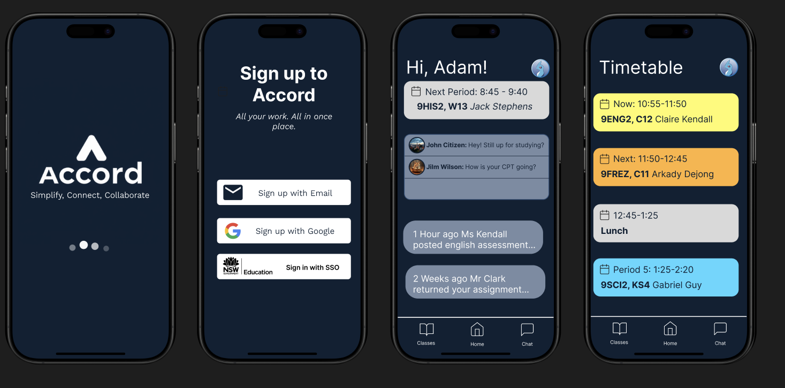
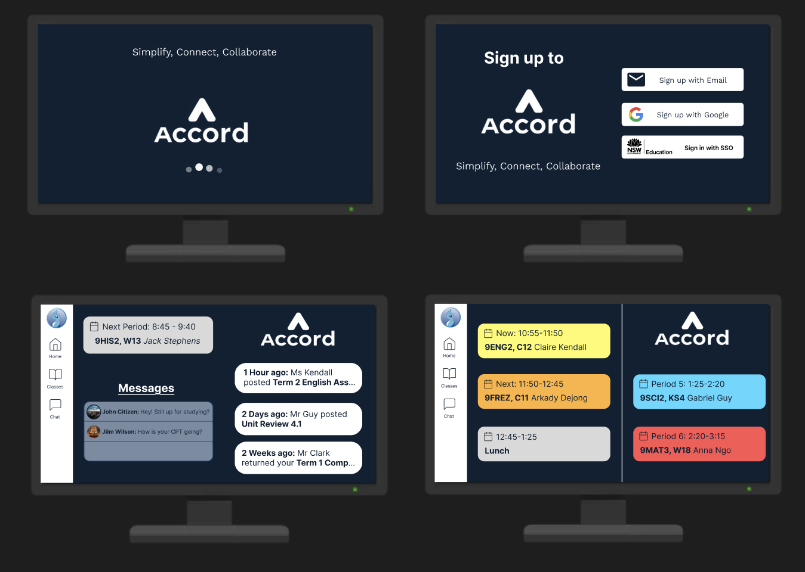
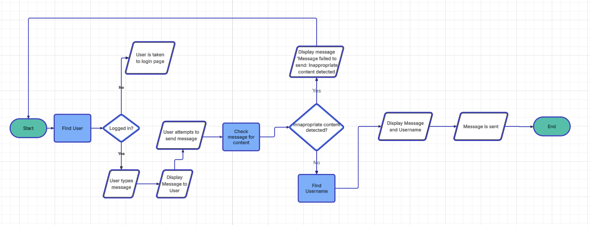
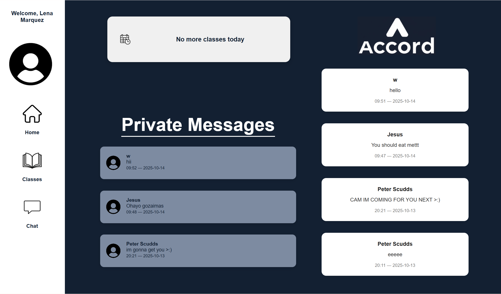
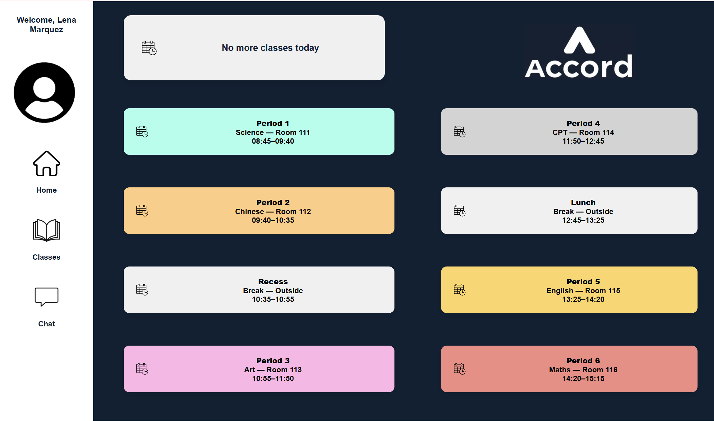
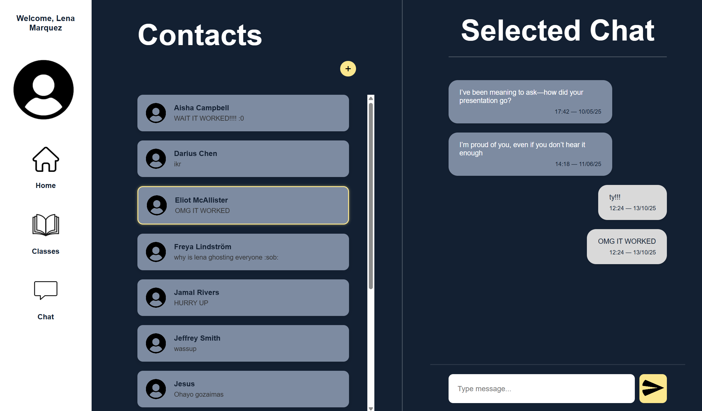

# Week 1

## Project Definition
The goal of this project is to create a web application for a client, set up on github. The web application must have a working frontend and backend that can communicate with each other, created using a variety of different progamming methods including httml/css, Sqllite, and others. This web application is to be created in a set of weekly sprints, incorporating feedback from the client into the final product so it is tailored specifically to their needs. The web application should be designed around social network designed in the project at the end of last year.

## Requirements
### Functional:
- Timetable displaying periods throughout the day
- Messaging system for users to connect
- User authentication
- Assignment submission

### Non-Functional
- Multiple web pages
- Suitable colouring of backgrounds and text
- Appropiately sized and fonted text
- Inclusion of images and other elements

# Week 2

| Design Choice | Description |
| ----------- | ----------- |
| Colour Palette | I decided on a simple two colour design of white text on a navy blue background. It's basic but aesthetically pleasing, and the text is easily legible.  |
| Typography | I decided on the font 'Inter', as it is simple and easily legible. It is also one of the most professionally used fonts, so it works well with my website's design. |
| Image/Icon choice | I used a simple logo that will appear on the loading screen whenever the app is opened. I also used profile pictures for the messaging system, so that users can be distinguished. These profile pictures will be customisable for each user once the app is completed. |

# Week 3

| Design Choice | Description |
| ----------- | ----------- |
| Colour Palette | I kept majority of the colour palette the same in my alternate design, using the same navy blue and white. However, I changed some of the colouring on specific parts of my UI, such as making the navigation menu white rather than the previous dark blue.  |
| Typography | I decided to keep the font 'Inter', as it looks nice and is easily readable. |
| Image/Icon choice | My images and icons, such as the logo and profile pictures, remain the same in my alternate design. However, I did change the layout of some of the images, such as keeping the brand logo in the corner of every page now instead of just the loading screen. |
| Layout | Additionally, I changed the layout of my UI a lot as part of the alternate design. My design was mainly centered around changing the interface from a phone to a computer, meaning there is a lot more space on the screen to work with. This allowed me to leave more empty space on each of my pages to to create a more clean and aesthetically pleasing visual. Additionally, I moved a lot of the UI around, such as the navigation menu moving from the bottom to the side, as well as a complete redesign of the Home page and Timetable page. |

# Week 4

## Algorithm Design
The algorithm:

Test cases:
| Test Case name | Preconditions | Test steps | Expected result |
| ----------- | ----------- | ----------- | ----------- |
| User attempts to send message | User must have the application, and have the messaging system open | Type in a message, hit the send button | User will be able to send the message effectively |
| User attempts to send inappropriate message | User must have the application, and have the messaging system open | Type in an inappropriate message, hit the send button | User will receive error message 'Message failed to send: Inappropriate content detected', and message will fail to send |

# Week 5

## Setting up the Database

**Monday, 18/08/25**
Today, I began setting up the database by following through the instructions in the setup document on google classroom. I downloaded python, pip, and all of the required extensions, before working through the document up until the creation of the files and the folders.

**Tuesday, 19/08/25**
Today, I finished working through the document and setting up my database. I created all of the folders necessary for my database, before creating the database table and running commands to populate it.

**Thursday, 21/08/25**
Today, I figured out 

# Week 6

**Monday, 25/08/25**

**Tuesday, 26/08/25**

**Wednesday, 27/08/25**

# Week 7

**Monday, 01/09/25**

**Tuesday, 02/09/25**

**Thursday, 04/09/25**

# Week 8

**Monday, 08/09/25**

**Tuesday, 09/09/25**

**Wednesday, 10/09/25**

# Week 9

**Monday, 15/09/25**

**Tuesday, 16/09/25**

**Thursday, 18/09/25**

# Week 10

**Monday, 22/09/25**

**Tuesday, 23/09/25**

**Wednesday, 24/09/25**

# Holidays!!!

**Monday, 13/10/25**
Today, I finalised my app by finishing up the functionality of the messaging system and timetable, as well as implementing a public messaging system for teachers and cleaning up the aesthetics of the app.

# Finished Product:

